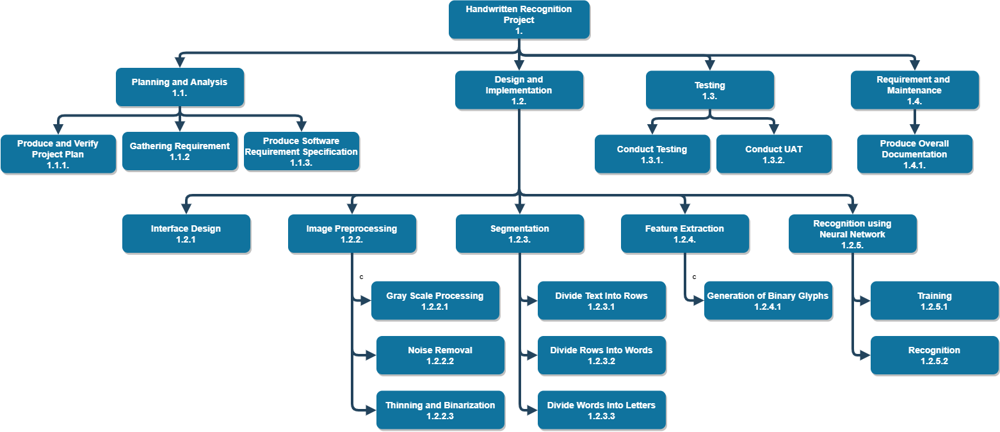
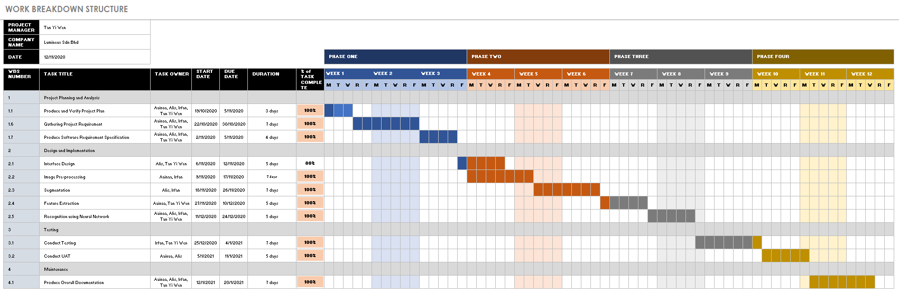
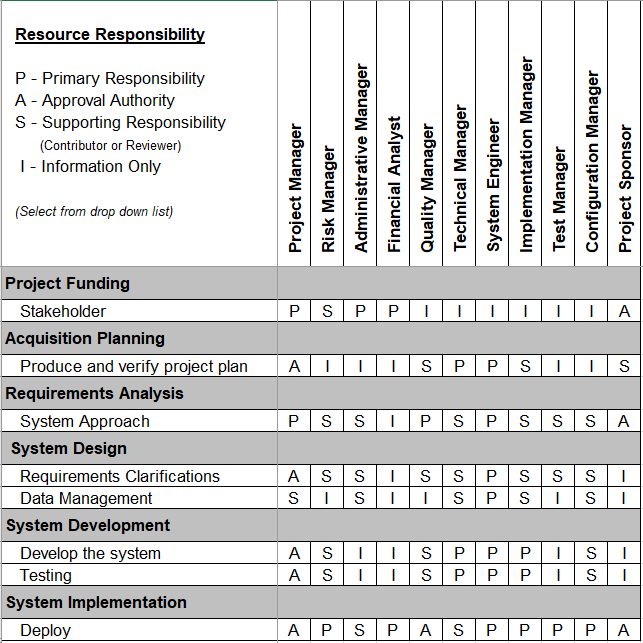
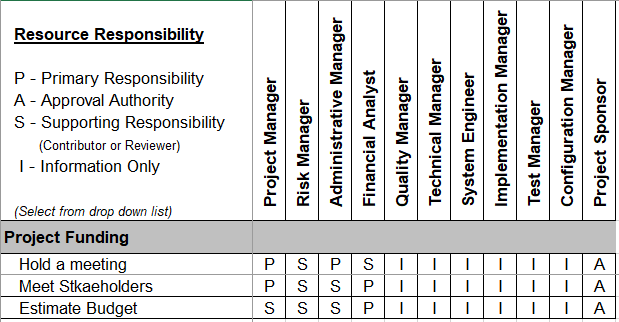
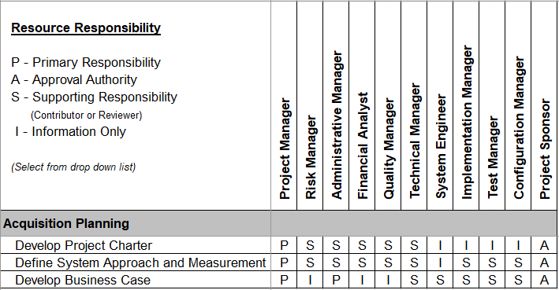
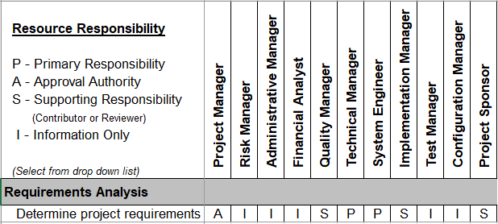
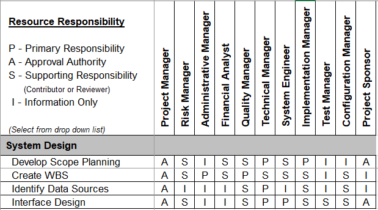
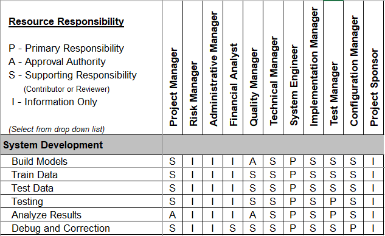
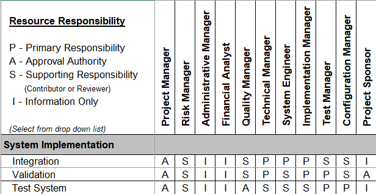

# PROJECT OVERVIEW
## B. PLANNING THE PROJECT
### Project Management Life-Cycle
The project management life cycle is represented and documented in the form of Gantt Chart. A Gantt chart is a project management tool assisting in the planning, showing start and end dates, as well as dependencies, scheduling and deadlines, including how much of the task is completed per stage and who is the task owner.

The WBS is the Work Breakdown Structure. It is a hierarchical representation of the elements (tasks) that comprise a project. WBS of our project is shown below:
  

  
Project management WBS is shown in the Gantt Chart below:
  

### Risk Identification Chart (Quality, Cost, Time)
| Control Element | What is likely to go wrong? | How and when will I know? | What will I do about it? |
|     :---:       |           :---:             |           :---:           |           :---:          |
| Quality         | git status                  | git status                | git status               |
| Cost            | git diff                    | git diff                  | git diff                 |
| Time            |git diff                    | git diff                  | git diff                 |

### Responsibility Assignment Matrices (RAM):

 

|     Roles              |        Person In Charge     |      Responsibility       |
|     :---:              |           :---:             |           :---:           |
| Project Manager        | Tan Yi Wen                  | Project managers play the lead role in planning, executing, monitoring, controlling and closing projects. Project managers are accountable for the entire project scope, project team, resources, and the success or failure of the project.                | 
| Risk Manager           | Alis                    | The role of a Risk Manager is to communicate risk policies and processes for Lumineux Sdn. Bhd.. They provide hands-on development of risk models involving market, credit and operational risk, assure controls are operating effectively, and provide research and analytical support.                  |
| Administrative Manager | Alis                    | Administrative Managers supervise administrative team members and ensure that daily office operations are performed in a seamless and efficient manner. Administrator manager needs to list all possible content that can be displayed in the document form  after each process in the hand-written text recognition project.         |
| Financial Analyst        | Irfan              | Financial analysts are responsible for supporting administrative managers by managing and tracking the costs of hand-written text recognition projects, preparing budget documents. For example, Special Project Reports and OSI Budget Change Proposals, reviewing budget/contract expenditures, and collecting and our reporting financial metrics. This includes reconciling the accounting and Work Breakdown Structure cost management processes and developing financial management policies and procedures.              | 
| Quality Manager           | Irfan             | Quality Manager provides insight into the hand-written text recognition project and contractor methods of doing business by reviewing process and product activities for adherence to standards and plans. Quality Manager have to Understand customer needs and requirements to develop effective quality control processes
| Technical Manager | Aainaa              | Technical Manager is responsible for making key decisions for technical issues related to the company after considering everything from cost to quality of hardware or software. The technical manager must provide guidance for all members of the team when it comes to designing, implementing, and updating software.                  |
| System Enigineer | Aainaa| System Engineer has responsibility in managing and monitoring all installed systems and infrastructure, Installing, configuring, testing and maintaining operating systems, application software and system management tools, as well as ensuring the highest levels of systems and infrastructure availability.                 |
| Implementation Manager        | Aainaa             | Implementation project manager is responsible for managing a team of implementation specialists, who develop new software or configure new hardware for the client. They ensure teams are on task and team deadlines are met.       | 
| Test Manager           | Irfan             | Test manager is responsible for the planning, coordination, and control of various test activities. They first create a test process and test strategy that analyzes which test methods and tools are suitable and used for test activities.      |
| Configuration Manager | Tan Yi Wen           | Configuration Manager has responsibility to Identify, organize, and control software and hardware configuration changes. Identify and coordinate processes for version management, system build, backup and recovery, archiving, and change management. Support and facilitate auditing and reporting.                 |

      

Next: [Project Implementation](C-Project_Implementation.md)
