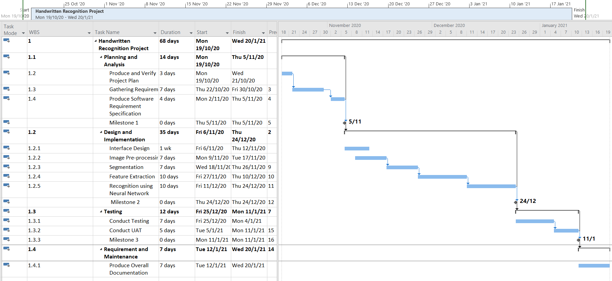

# PROJECT OVERVIEW
## C. IMPLEMENTING THE PROJECT
### Deliverables:
**Hardware Requirement:**
...

**Software Requirement:**
...

**Intelligent System Architecture:**
...

### Tasks and Estimated Costs
|     Task              |        Estimated Costs     |      Notes       |
|     :---:              |           :---:             |           :---:           |
|        | git status                  | git status                | 
|     | git diff                    | git diff                  |
|  | git diff                    | git diff                  |
|  TOTAL      | git status                  | git status      |          

### Milestone Chart
|     Milestone              |       Scheduled Completion     |      Actual Completion       |
|     :---:                   |           :---:             |           :---:           |
|   Planning and Analysis      | 5/11/2020                  | 4/11/2020                | 
|  Design and Implementation   | 24/12/2020                  | 24/12/2020                  |
| Testing                     | 11/1/2020                    | 10/1/2020                  |
| Requirement and Maintenance | 20/1/2020                    | 20/1/2020                  |         

**Microsoft Project:**

      

Next: [Project Execution](D-Project_Execution.md)
