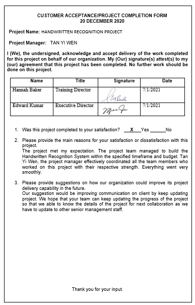
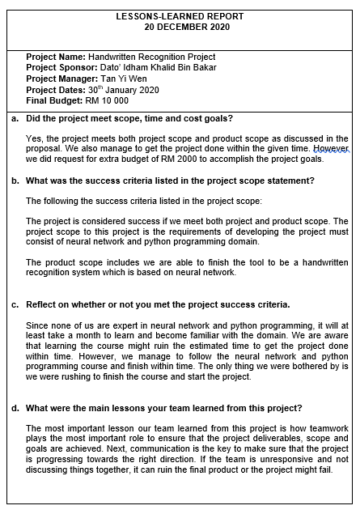
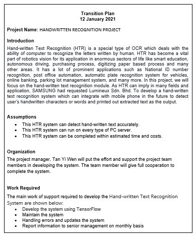
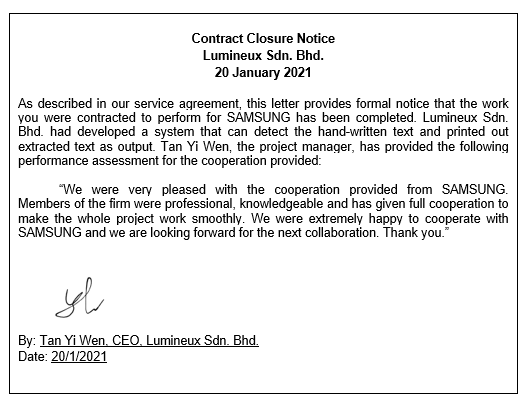

# PROJECT OVERVIEW
## E.  COMPLETING THE PROJECT
### Closing Checklist
**1. Customer Acceptance Form**

**2. Lessons Learned Document**

**3. Final Project Report**
**Hand-written Text Recognition**

**3.1 PROJECT OBJECTIVES**
The Hand-written Text Recognition (HTR) System developed by Lumineux Sdn. Bhd. was intended:
- To develop an Artificial Intelligence system that are able to detect user's handwritten characters or words.
- To construct a tool that takes an image from it as an input and extracts characters (alphabets, digits, symbols).
- To develop a tool which can scan the inputted handwritten images and printed out extracted text as the output.

**3.2 PROJECT RESULTS**
This Hand-written Text Recognition (HTR) System is developed successfully which is able to scan and detect the characters or words correctly.

**3.3 ORIGINAL AND ACTUAL SCHEDULE**
The project members stick to the plan as in Gantt Chart and all progress are on track which fit to the original schedule.

**3.4 ORIGINAL AND ACTUAL BUDGET**
The actual budget is RM 1,079,440.00, which is RM 101,160 less than the estimate budget costs.
### Tasks and Estimated Costs
|     Task              |        Estimated Costs (RM)     |      Actual Costs (RM)       |
|     :---:              |           :---:             |           :---:           |
| Software      | 5,000.00  |     4,500.00          | 
| Scanner   | 6,000.00 |   6,000.00              |
| Computer | 12,000.00 |       12,000.00           |
| Database | 1,800.00 |       1,500.00          |
| Travel Expenses | 50,000.00 |      47,620.00            |
| Rentals | 160,000.00 |      150,000.00            |
| Wages | 12,000.00 |         10,000.00         |
| Advertising | 150,000.00 |       150,000.00           |
| Maintenance | 16,000.00 |      12,500.00            |
| Insurance | 8,000.00 |    8,000.00              |
| Building Rent | 4,500.00 |     4,500.00             |
| IT Services | 2,000.00 |     1,800.00             |
| Data Collection | 500,000.00  |      429,020.00             |
| Conseptual Design | 6,000.00  |       6,000.00           |
| Preliminary Design | 15,000.00  |       14,000.00            |
| Final Design | 1,000.00  |    1,000.00             |
| Construction Labor | 12,000.00  |     11,000.00            |
| Construction Supervision | 10,000.00  |      10,000.00             |
| Materials | 50,000.00  |    50,000.00              |
| Permits | 300.00  |       300.00           |
| Surveys | 2,000.00  |      1,700.00         |
| Architectual Design | 18,000.00  | 18,000.00  |
| Rentals | 10,000.00  |  10,000.00  |
| Software | 1,000.00  | 1,000.00    |
| Indirect Costs | 128,000.00 |     119,000.00             |
|  TOTAL      | 1,180,600.00   |  1,079,440.00    |

**3.5 PROJECT ASSESSMENT**

**3.5.1 SCOPE**

The project scope of this project is accomplished as the Hand-written Text Recognition (HTR) System which are target to be used in many sectors and applications. Example of sectors are sectors of life like smart education, autonomous driving, purchasing process, digitizing paper based process and many other areas. Example of prominent applications are National ID number recognition, post office automation, automatic plate recognition system for vehicles, online banking, parking lot management system, and many more. The requirement for finishing this project is to have an expert knowledge in neural networking and programming in python.

**3.5.2 OBJECTIVES**

Lumineux Sdn. Bhd. had successfully achieve the objectives initializes since the beginning of the project. The Hand-written Text Recognition (HTR) System developed was intended to develop an Artificial Intelligence system that are able to detect user's handwritten characters or words and printed out extracted text as the output. In this project,Deep learning is used to identify and read the words or characters on the image of hand-written text.

**3.5.3 SUCCESS CRITERIA**

The success criteria listed in the project scope management is to complete the project within 4 months, and the estimated budget cost is RM 1,180,600.00 . The project should meet all customer requirements specified in the project scope management. The project manager should ensure that after creating and well-controlled Gantt charts in the process, all team members stay on track to achieve scope goals.

**3.5.4 TRANSITION PLAN**

**4. Close Contract**

      

Next: [Project Presentation](F-Project_Presentation.md)
